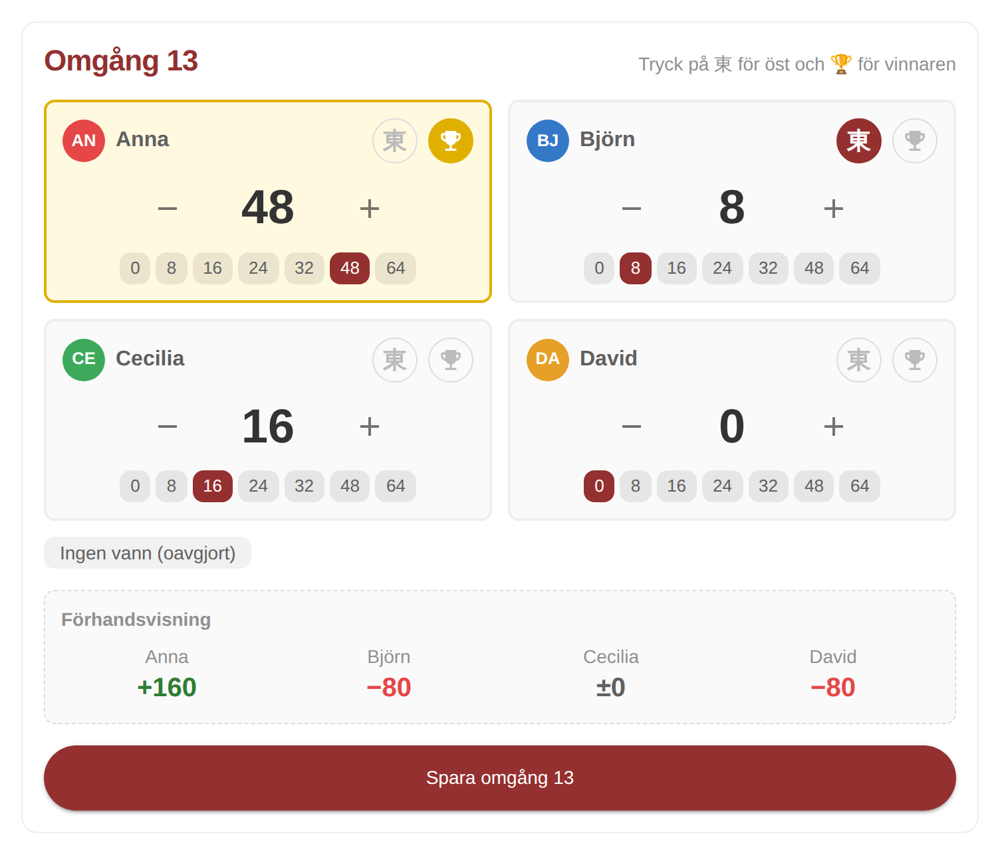
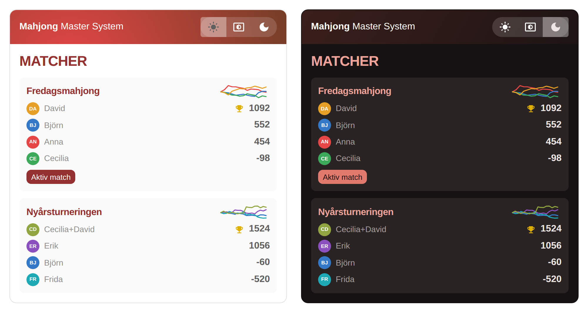
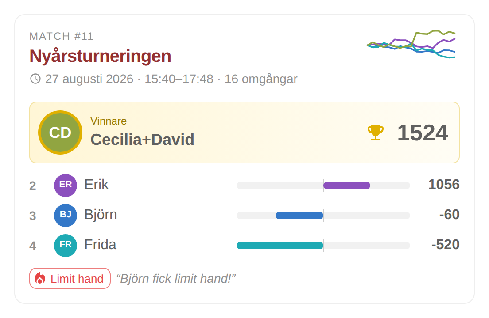
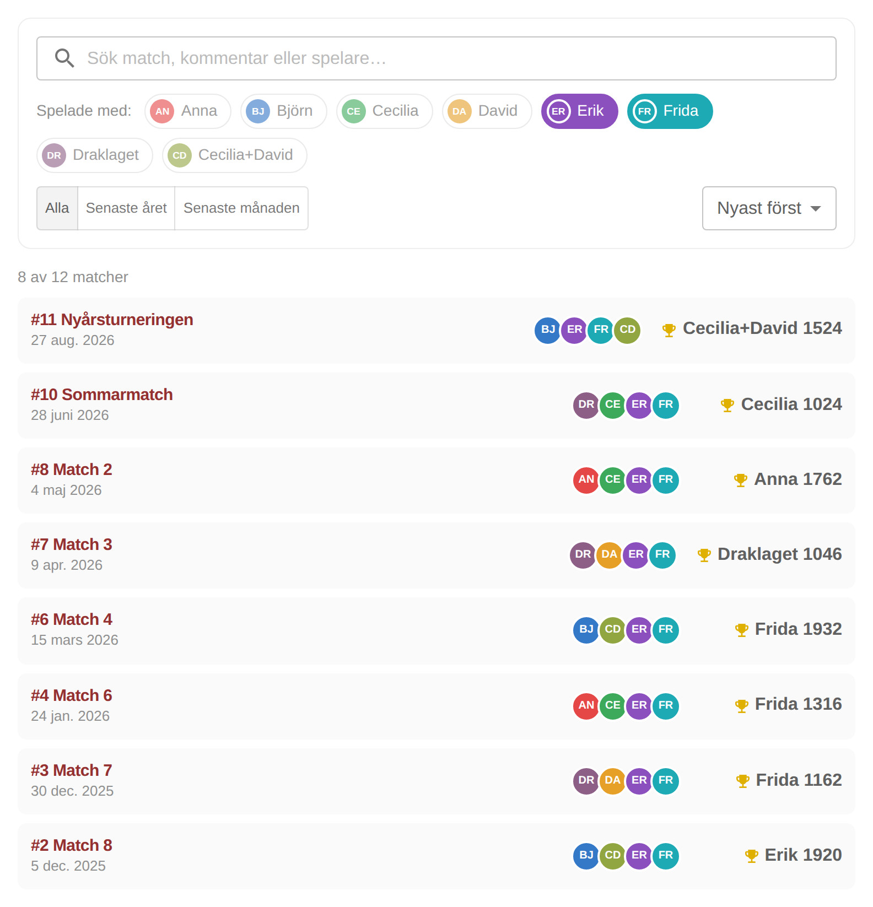
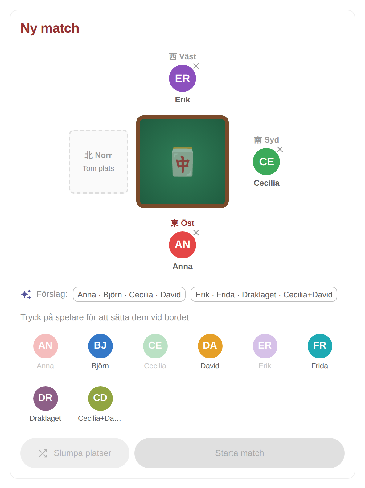
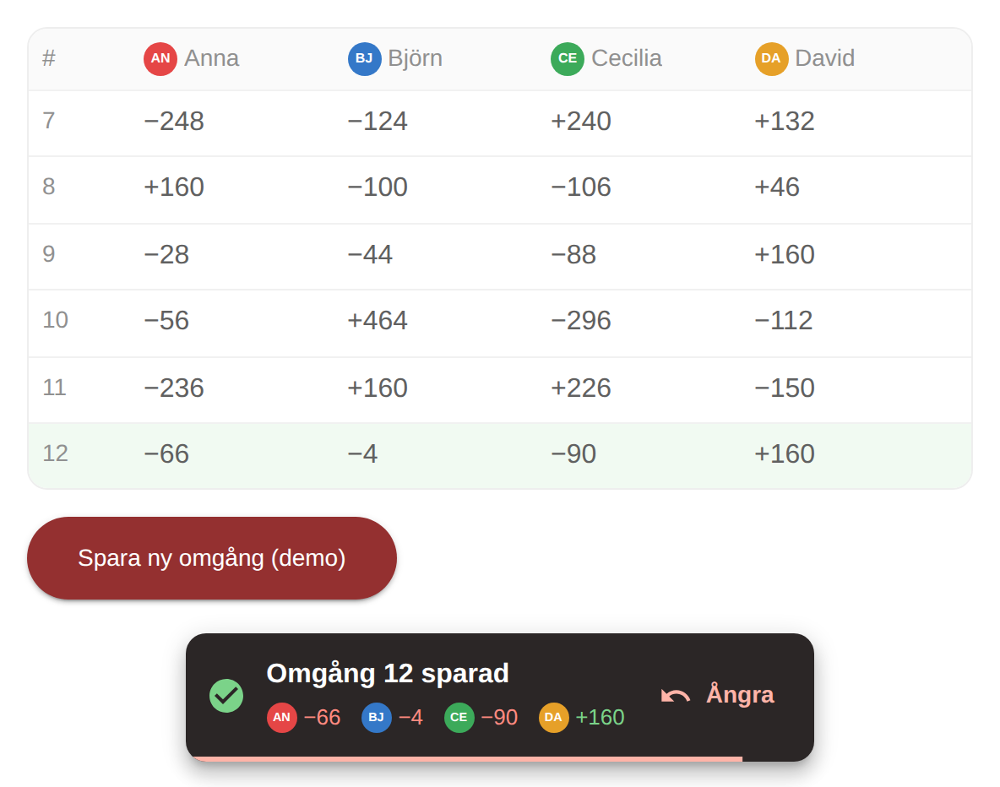
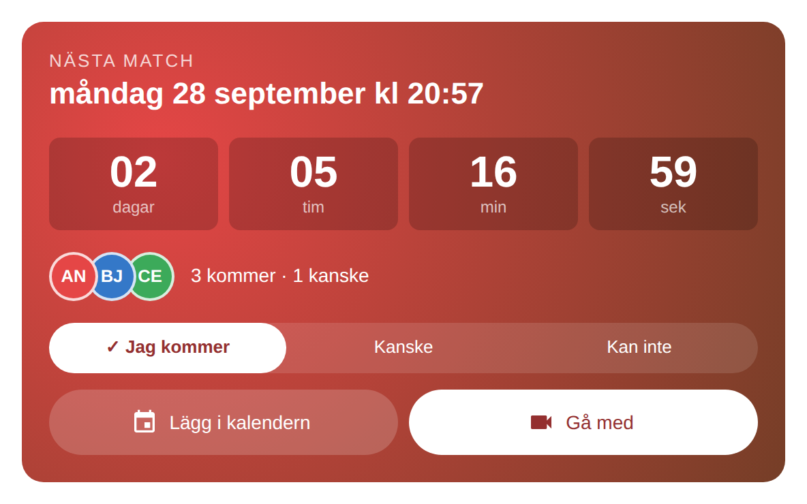
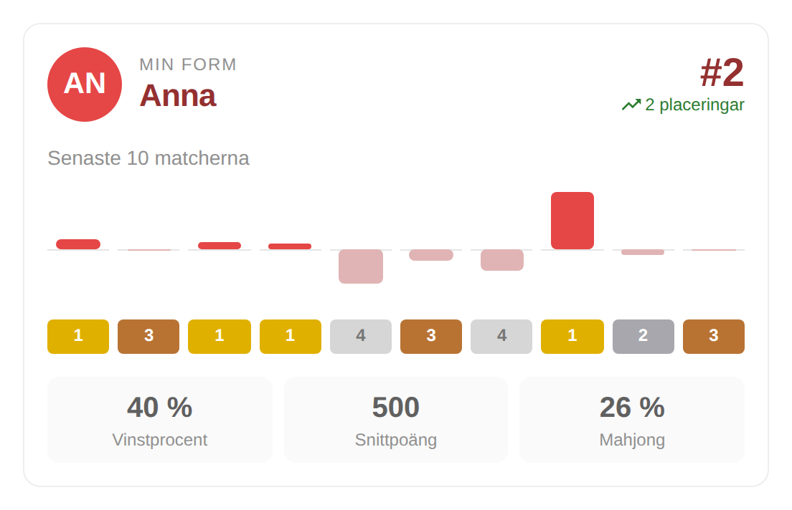
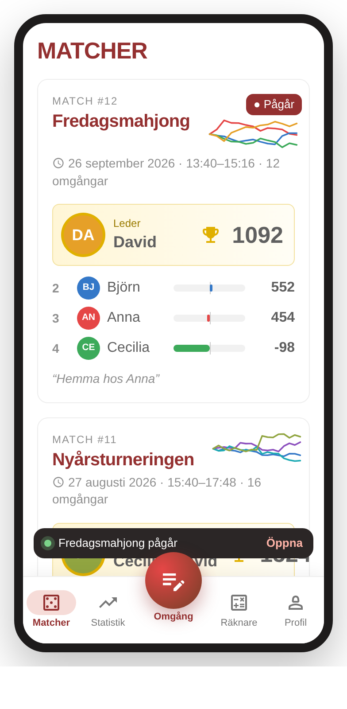
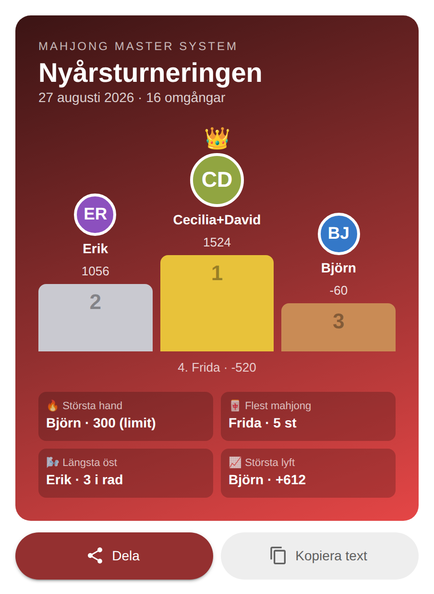

# Tio förbättringsförslag

Prototyper som gör systemet snyggare eller enklare att använda. Varje förslag är en fristående
React-komponent i `src/components/proposals/` med stories i Storybook under **Förbättringsförslag**
(`npm run storybook`). Inget av dem är inkopplat i appen än – välj de du gillar så bygger vi in dem.

## 1. Snabbregistrering av omgång
Registrera en omgång med tryck i stället för fyra textfält och två rullistor. Snabbval för vanliga
poäng, ±2-knappar, 東 för öst och 🏆 för vinnaren. Visar hur poängen ändras *innan* man sparar och
säger vad som saknas (eller vilka poäng som är udda).

## 2. Mörkt läge
Dark mode-variablerna i `globals.css` är i dag samma som de ljusa. Ett riktigt mörkt tema med
sol/auto/måne-väljare är skönare runt bordet på kvällen.

## 3. Nytt matchkort
Vinnaren lyfts fram, varje lag får en stapel som visar hur långt över/under 500 de slutade och en
liten graf visar hur matchen gick.

## 4. Sök och filtrera matcher
Sök på namn, kommentar eller spelare, filtrera på vilka som spelade och tidsperiod, sortera.

## 5. Visuell platsväljare för ny match
Tryck på spelarna för att sätta dem runt bordet (öst, syd, väst, norr), slumpa platser eller välj
ett föreslaget lag.

## 6. Ångra omgång
I stället för att ladda om sidan visas en notis "Omgång 12 sparad" med poängen och en
Ångra-knapp i tio sekunder – slipper gå till "Rätta" vid felslag.

## 7. Nedräkning till nästa match
Kommande match som ett tydligt kort på startsidan: nedräkning, "Jag kommer / Kanske / Kan inte",
lägg i kalendern (.ics) och länk till mötet.

## 8. Min form
Personlig sammanfattning för inloggad spelare: placering och trend, senaste tio matcherna,
vinstsviter, vinstprocent, snittpoäng och mahjong-andel.

## 9. Mobilmeny med stor knapp
Bottenmeny med en stor knapp i mitten – "Ny match", eller "Registrera omgång" när en match pågår –
och en tydligare markering av aktuell sida. En banderoll visar att en match pågår.

## 10. Delbar matchsammanfattning
Ett snyggt kort med prispall och kvällens höjdpunkter som kan delas i gruppchatten
(Web Share API, eller kopiera som text).

