# Förslag: förbättrade matchkort på startsidan

Tio React-förslag för matchkorten på startsidan (`MatchGridItemClient`).
Alla förslag finns som fungerande komponenter i
`src/components/matches/proposals/` och kan provas i Storybook under
**Proposals/MatchCards** (`npm run storybook`).
Gemensam data (placering, poänghistorik, vind, lagfärger) räknas ut i `matchCardData.ts`.

## Nuvarande kort

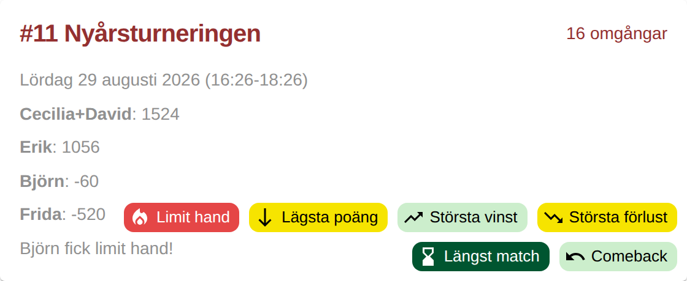

Poängen är en lista i grå text, vinnaren syns inte särskilt tydligt och märkena
(badges) ligger absolut positionerade så att de kan täcka poängen och kommentaren.

## 1. Pallplacering
Topp tre som en prispall med medaljer, fjärde plats under. Vinnaren syns direkt.

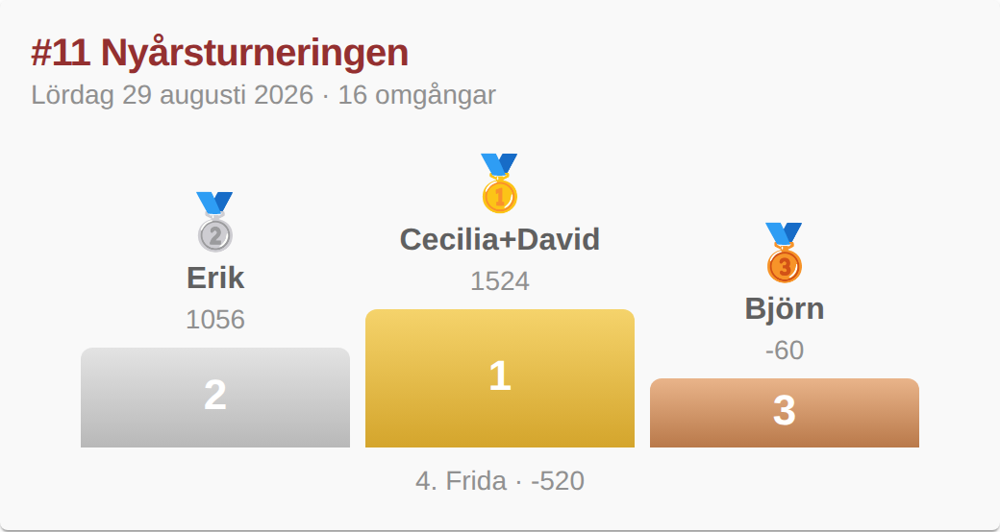

## 2. Poängstaplar
Divergerande staplar för varje lags +/- mot startpoängen 500. Gör det lätt att se hur jämn matchen var.

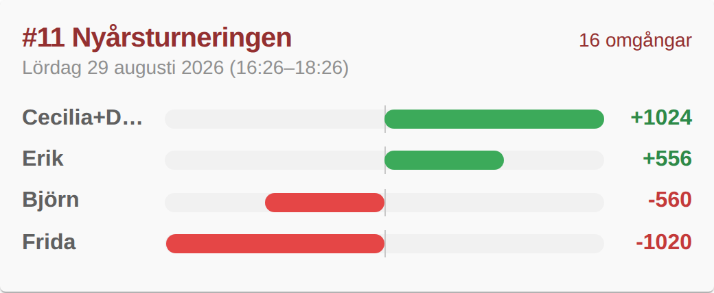

## 3. Minigraf
En liten linjegraf (inline-SVG, inget extra bibliotek) med poängutvecklingen per omgång i lagens färger.

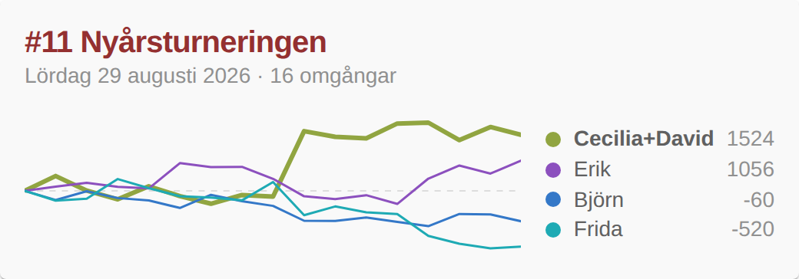

## 4. Lagfärger & avatarer
Spelarnas färger (samma som i matchgrafen) används för avatarer, rutor och en färgad vänsterkant för vinnaren.

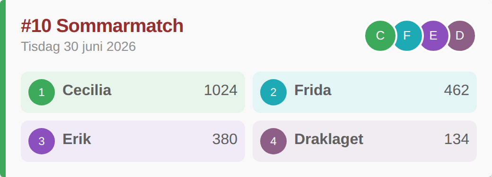

## 5. Kompakt rad
Tät tabellvy med placering, poäng och +/-. Passar mobilen och gör att fler matcher får plats.

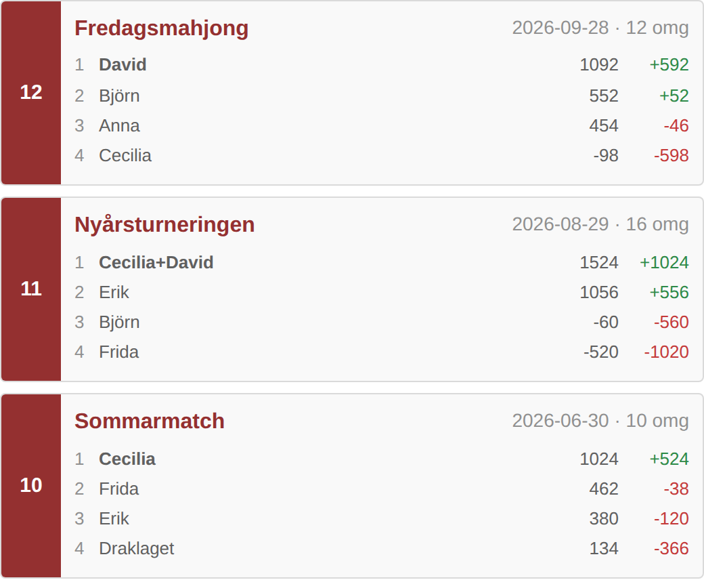

## 6. Live-läge
Pågående matcher får en pulserande LIVE-markering, aktuell omgång, vem som sitter öst (東) och ledningens storlek.

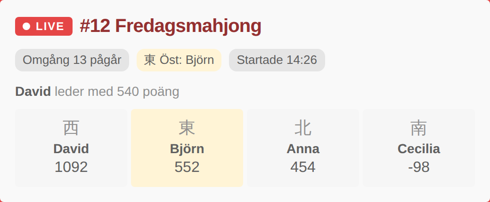

## 7. Vinnaren i fokus
Gradienthuvud i appens färger med vinnaren, antal vunna händer och största hand. Övriga lag i en rad under.

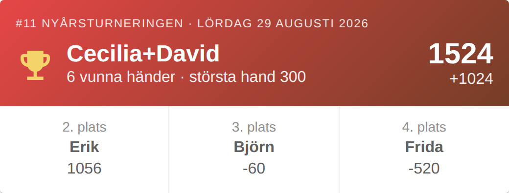

## 8. Mahjongbrickor
Lagen visas som mahjongbrickor med sin vind på en filtgrön spelduk – ger startsidan mer mahjongkänsla.

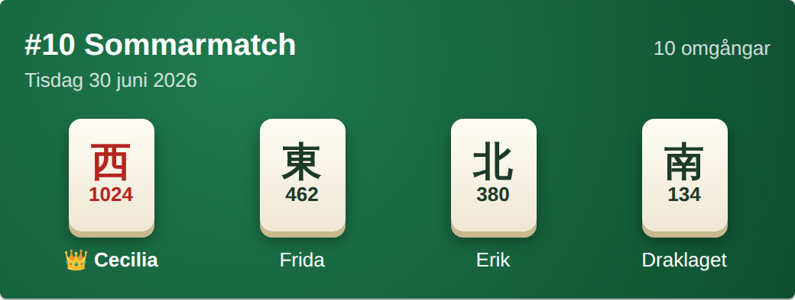

## 9. Nyckeltal
Fast statistikrad (speltid, omgångar, största hand, marginal) och märken i ett eget fält längst ned, så att de aldrig täcker poängen.

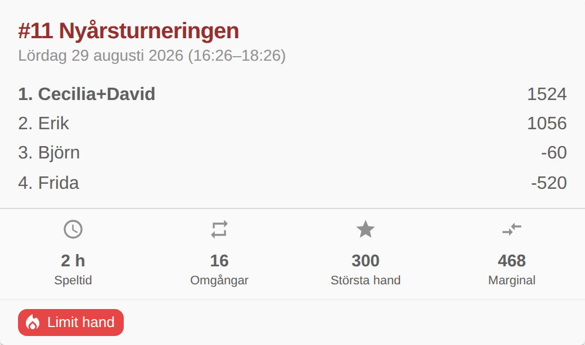

## 10. Expanderbart kort
Kort sammanfattning som kan fällas ut för att visa de senaste omgångarna direkt på startsidan, med hover-lyft och en knapp till matchen.

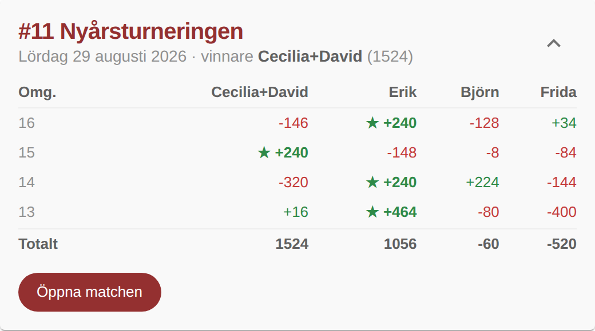
