# Förslag: förbättrade spelarresultat på matchsidan

Tio React-förslag för widgeten med spelarnas resultat under "Senaste omgången"
på matchsidan (`LastRoundDisplay`). Alla förslag finns som fungerande komponenter i
`src/components/match/proposals/` och kan provas i Storybook under
**Proposals/PlayerResults** (`npm run storybook`).
Gemensam data (placering före/efter, totalpoäng, vind, lagfärger, märken, poänghistorik)
räknas ut i `playerResultData.ts`.
Lagen ligger i samma ordning som i dag och märkena (badges) visas i alla förslag. Skärmbilderna visar omgång 9 i Nyårsturneringen (limit hand).

## Nuvarande widget

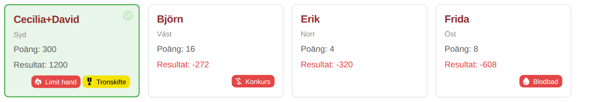

Rubriken "Poäng" är egentligen handens värde, totalställningen syns inte alls, alla
kort ser lika ut förutom den gröna vinnaren och färgerna matchar inte grafen ovanför.

## 1. Ställning
Totalpoängen är huvudsiffran, med placeringen bredvid, omgångens resultat under och en pil
som visar om laget klättrat eller tappat placeringar.

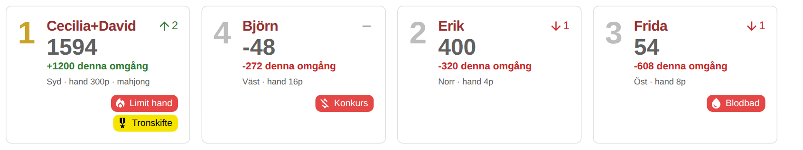

## 2. Vindbrickor
Varje kort får en mahjongbricka med spelarens vind (東 南 西 北).
Vinnaren får ett guldkort och en "Mahjong!"-etikett.

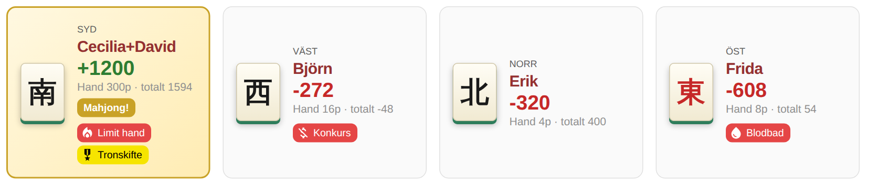

## 3. Lagfärger
Samma färger som linjerna i matchgrafen används för en färgad topplist, avatar och
vinnarram, så det är lätt att koppla ihop korten med grafen.

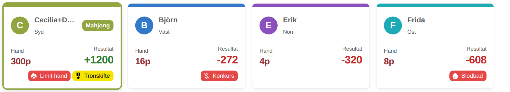

## 4. Kompakt tabell
En tabellrad per lag med placering, vind, hand, resultat, totalt och märken. Passar mobilen och gör "Alla omgångar" mycket kortare.

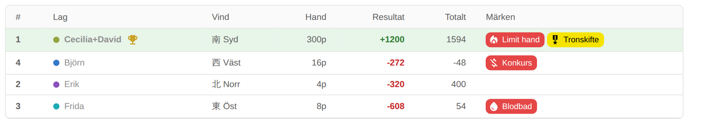

## 5. Poängstaplar
Divergerande staplar kring noll visar direkt vem som vann och vem som fick betala – och hur mycket.

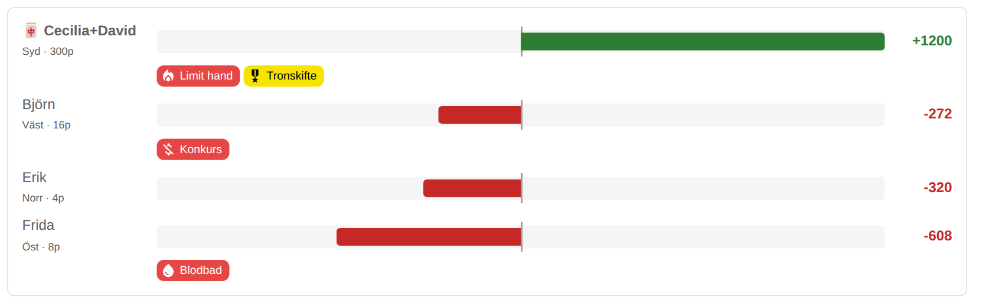

## 6. Vinnaren i fokus
Vinnaren ligger kvar på sin plats men får ett kort i appens röda gradient med stora siffror.
Övriga lag tonas ned.

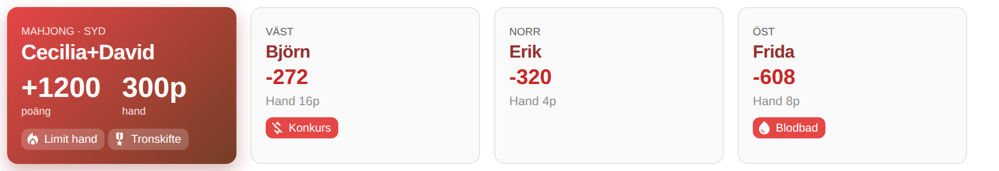

## 7. Minigraf
En liten linjegraf (inline-SVG) med lagets totalpoäng genom matchen i varje kort, på
gemensam skala och med startpoängen 500 streckad.

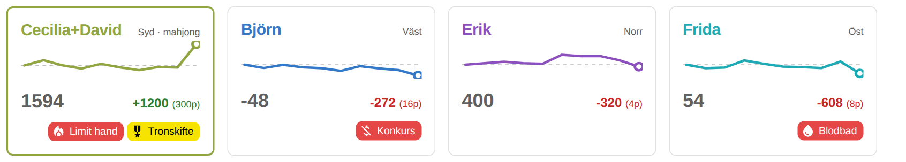

## 8. Före → efter
Totalen räknas upp animerat (motion) från ställningen före omgången till efter, så att
förändringen märks när en ny omgång dyker upp via auto-reload.

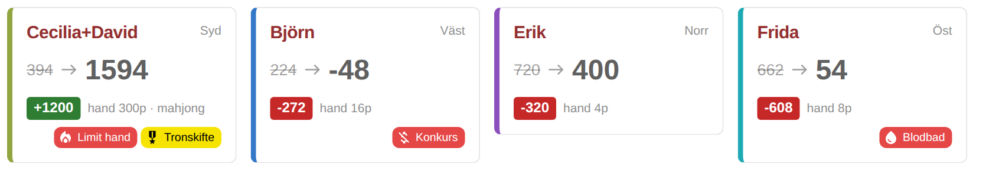

## 9. Spelbordet
Lagen sitter runt ett filtbord på sin vinds plats, precis som omgången spelades,
med vinnaren markerad och en sammanfattning i mitten.

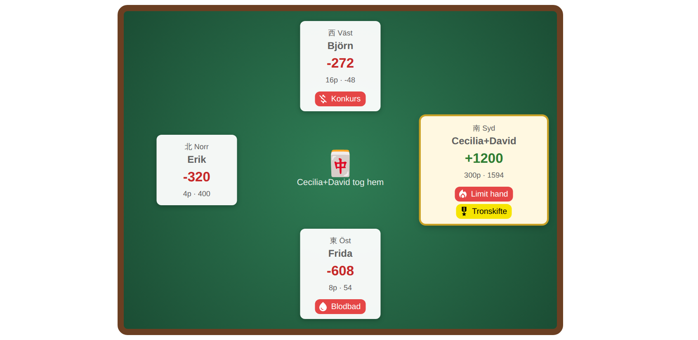

## 10. Omgångsväljare
En enda widget med pilar och reglage för att bläddra mellan omgångarna i stället för den
långa "Visa alla omgångar"-listan.

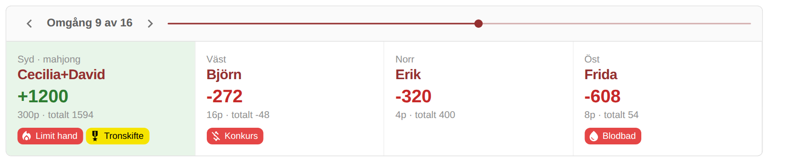
